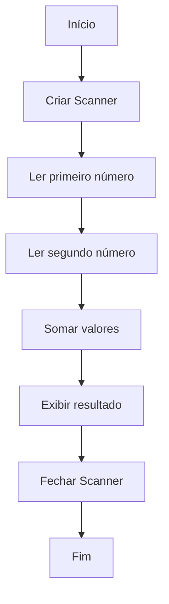

<div align="center">

# ☕ Desafios e Atividades em Java

Repositório de estudos com exercícios, desafios e pequenos programas desenvolvidos durante minha evolução na linguagem Java.


</div>

---

## 📌 Sobre o repositório

Este repositório reúne exercícios, atividades e pequenos programas desenvolvidos durante meus estudos de Java.

O objetivo é registrar minha evolução desde os fundamentos da linguagem até conteúdos mais avançados, mantendo exemplos simples e progressivos de conceitos como:

* sintaxe;
* variáveis;
* tipos de dados;
* operadores;
* entrada e saída;
* estruturas condicionais;
* estruturas de repetição;
* métodos;
* arrays;
* coleções;
* orientação a objetos;
* tratamento de exceções;
* organização de projetos.

Atualmente, o repositório contém exercícios introdutórios de entrada, processamento e saída de dados.

> Este é um repositório educacional. Os códigos representam diferentes etapas do aprendizado e poderão ser refatorados conforme novos conhecimentos forem adquiridos.

---

## 🎯 Objetivos

Os principais objetivos deste repositório são:

* praticar a sintaxe do Java;
* desenvolver lógica de programação;
* compreender o funcionamento da JVM;
* trabalhar com entrada e saída de dados;
* criar programas executados no terminal;
* utilizar classes e métodos;
* estudar orientação a objetos;
* aplicar boas práticas de organização;
* registrar a evolução técnica;
* construir uma base de consulta para estudos futuros.

---

## 🧩 Exercícios disponíveis

### Hello, World

Programa introdutório que exibe uma mensagem no terminal.

```java
public class App {

    public static void main(String[] args) {
        System.out.println("Hello, World!");
    }
}
```

Conceitos praticados:

* declaração de classe;
* método `main`;
* saída com `System.out.println`;
* compilação;
* execução de um programa Java.

---

### Soma de dois números

Programa que solicita dois números inteiros ao usuário e apresenta o resultado da soma.

```java
import java.util.Scanner;

public class Main {

    public static void main(String[] args) {
        var scanner = new Scanner(System.in);

        System.out.print("Informe o primeiro número: ");
        var numero1 = scanner.nextInt();

        System.out.print("Informe o segundo número: ");
        var numero2 = scanner.nextInt();

        System.out.printf(
            "%d + %d = %d%n",
            numero1,
            numero2,
            numero1 + numero2
        );

        scanner.close();
    }
}
```

Conceitos praticados:

* importação de classes;
* utilização de `Scanner`;
* entrada de dados;
* variáveis locais;
* inferência de tipo com `var`;
* operadores aritméticos;
* saída formatada com `printf`.

---

## 🔄 Fluxo do exercício de soma



---

## 🛠️ Tecnologias utilizadas

| Tecnologia | Aplicação                      |
| ---------- | ------------------------------ |
| Java       | Desenvolvimento dos exercícios |
| JDK        | Compilação e execução          |
| Scanner    | Entrada de dados pelo terminal |
| Git        | Controle de versão             |
| GitHub     | Hospedagem e documentação      |
| VS Code    | Desenvolvimento dos códigos    |

---

## 📁 Estrutura atual

```text
Desafios-e-Atividades-em-Java/
│
├── App.java
├── Main.java
└── README.md
```

| Arquivo     | Descrição                          |
| ----------- | ---------------------------------- |
| `App.java`  | Programa introdutório Hello World  |
| `Main.java` | Programa para soma de dois números |
| `README.md` | Documentação do repositório        |

---

## 🚀 Como executar

### Pré-requisitos

Para executar os exercícios, é necessário possuir:

* Java Development Kit — JDK;
* Git;
* terminal ou Prompt de Comando;
* editor de código, opcionalmente.

Verifique a instalação do Java:

```bash
java --version
```

Verifique o compilador:

```bash
javac --version
```

---

### 1. Clone o repositório

```bash
git clone https://github.com/ONestoDev/Desafios-e-Atividades-em-Java.git
```

### 2. Acesse a pasta

```bash
cd Desafios-e-Atividades-em-Java
```

---

## ▶️ Executando o Hello World

Compile:

```bash
javac App.java
```

Execute:

```bash
java App
```

Resultado:

```text
Hello, World!
```

---

## ▶️ Executando a soma

Compile:

```bash
javac Main.java
```

Execute:

```bash
java Main
```

Exemplo:

```text
Informe o primeiro número: 10
Informe o segundo número: 5
10 + 5 = 15
```

---

## 🧠 Conceitos fundamentais

### Classe

Todo programa Java é organizado dentro de classes.

```java
public class Main {
}
```

### Método principal

O método `main` representa o ponto inicial da aplicação.

```java
public static void main(String[] args) {
}
```

### Saída de dados

Uma mensagem pode ser exibida com:

```java
System.out.println("Olá, Java!");
```

### Entrada de dados

A classe `Scanner` permite ler valores informados pelo usuário:

```java
Scanner scanner = new Scanner(System.in);

int numero = scanner.nextInt();
```

### Operadores aritméticos

Java possui operadores como:

| Operador | Operação         |
| -------- | ---------------- |
| `+`      | Adição           |
| `-`      | Subtração        |
| `*`      | Multiplicação    |
| `/`      | Divisão          |
| `%`      | Resto da divisão |

---

## 📚 Conteúdos planejados

Conforme a evolução dos estudos, o repositório poderá receber exercícios sobre:

### Fundamentos

* variáveis;
* tipos primitivos;
* operadores;
* entrada e saída;
* conversão de tipos.

### Estruturas de controle

* `if`;
* `else`;
* `switch`;
* `for`;
* `while`;
* `do-while`.

### Métodos

* parâmetros;
* retornos;
* sobrecarga;
* escopo;
* métodos estáticos.

### Estruturas de dados

* arrays;
* matrizes;
* listas;
* conjuntos;
* mapas.

### Orientação a objetos

* classes;
* objetos;
* atributos;
* construtores;
* encapsulamento;
* herança;
* polimorfismo;
* abstração;
* interfaces.

### Outros conteúdos

* exceções;
* arquivos;
* generics;
* streams;
* expressões lambda;
* datas;
* testes automatizados;
* organização em pacotes.

> Esses conteúdos representam o planejamento de evolução do repositório e não devem ser interpretados como funcionalidades já implementadas.

---

## 📂 Organização recomendada

À medida que novos exercícios forem adicionados, uma estrutura mais organizada poderá ser adotada:

```text
Desafios-e-Atividades-em-Java/
│
├── 01-fundamentos/
│   ├── hello-world/
│   └── soma-dois-numeros/
│
├── 02-condicionais/
├── 03-repeticao/
├── 04-metodos/
├── 05-arrays/
├── 06-poo/
├── 07-colecoes/
├── 08-excecoes/
│
└── README.md
```

Cada exercício poderá possuir sua própria pasta e um arquivo `README.md` com:

* objetivo;
* enunciado;
* conceitos;
* código;
* exemplo de execução;
* aprendizados.

---

## ✅ Boas práticas recomendadas

### Fechar o Scanner

Após utilizar o `Scanner`, feche o recurso:

```java
scanner.close();
```

### Utilizar nomes descritivos

Prefira:

```java
int primeiroNumero;
```

em vez de:

```java
int n1;
```

### Separar responsabilidades

Quando o programa crescer, extraia operações para métodos:

```java
public static int somar(int primeiroNumero, int segundoNumero) {
    return primeiroNumero + segundoNumero;
}
```

### Validar entradas

Programas interativos devem considerar valores inválidos:

```java
if (!scanner.hasNextInt()) {
    System.out.println("Informe um número inteiro válido.");
    return;
}
```

---

## 🧪 Versão aprimorada da soma

```java
import java.util.InputMismatchException;
import java.util.Scanner;

public class Main {

    public static void main(String[] args) {
        try (Scanner scanner = new Scanner(System.in)) {
            int primeiroNumero = lerNumero(
                scanner,
                "Informe o primeiro número: "
            );

            int segundoNumero = lerNumero(
                scanner,
                "Informe o segundo número: "
            );

            int resultado = somar(
                primeiroNumero,
                segundoNumero
            );

            System.out.printf(
                "%d + %d = %d%n",
                primeiroNumero,
                segundoNumero,
                resultado
            );
        }
    }

    private static int lerNumero(
        Scanner scanner,
        String mensagem
    ) {
        System.out.print(mensagem);

        try {
            return scanner.nextInt();
        } catch (InputMismatchException exception) {
            throw new IllegalArgumentException(
                "O valor informado deve ser um número inteiro.",
                exception
            );
        }
    }

    private static int somar(
        int primeiroNumero,
        int segundoNumero
    ) {
        return primeiroNumero + segundoNumero;
    }
}
```

Essa versão:

* fecha o `Scanner` automaticamente;
* separa leitura e cálculo;
* utiliza nomes mais claros;
* trata entradas inválidas;
* facilita testes futuros.

---

## ⚠️ Limitações atuais

O repositório ainda possui algumas limitações:

* contém poucos exercícios;
* os arquivos estão todos na raiz;
* não utiliza pacotes;
* não possui testes automatizados;
* não utiliza Maven ou Gradle;
* não possui tratamento de entrada no código atual;
* não existe um índice de atividades;
* ainda não possui projetos completos.

Essas limitações são compatíveis com um repositório inicial de estudos.

---

## 🗺️ Próximas melhorias

Entre as próximas evoluções possíveis estão:

* organizar exercícios por assunto;
* corrigir pequenos erros de escrita;
* adicionar exercícios condicionais;
* adicionar laços de repetição;
* criar métodos reutilizáveis;
* incluir exercícios de orientação a objetos;
* adicionar testes com JUnit;
* criar projetos com Maven;
* aplicar convenções de pacotes;
* adicionar exemplos de entrada e saída;
* criar um índice de exercícios;
* configurar GitHub Actions.

---

## 📚 Aprendizados desenvolvidos

Até o momento, o repositório trabalha:

* estrutura básica de um programa Java;
* classes;
* método `main`;
* saída de dados;
* entrada com `Scanner`;
* tipos numéricos;
* variáveis;
* operador de soma;
* saída formatada;
* compilação com `javac`;
* execução com `java`.

---

## 🎓 Contexto educacional

Repositório criado para reunir exercícios desenvolvidos durante cursos, bootcamps, disciplinas acadêmicas e estudos independentes de Java.

O projeto representa o início da evolução prática na linguagem e será ampliado conforme novos conteúdos forem estudados.

---

## 👨‍💻 Autor

Desenvolvido por **Ernesto — ONestoDev**.

[](https://github.com/ONestoDev)

---

## 📄 Licença

Este repositório possui finalidade educacional.

Os enunciados e materiais utilizados nos exercícios pertencem às respectivas instituições e autores.
